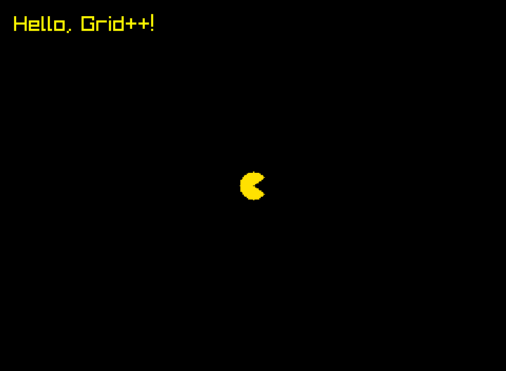

# 執行第一個程式

## 1. 用 VS Code 打開專案

在終端機貼上：

```bash
cd ~/GridPlusPlus-Pacman
code .
```

VS Code 會打開這個資料夾（Windows 第一次會多花一點時間安裝東西）。點左邊檔案列表裡的 `main.cpp`，就能看到程式碼：

```cpp title="main.cpp"
--8<-- "examples/pacman_tutorial/main.cpp"
```

!!! tip "在 VS Code 裡也有終端機"

    VS Code 選單「終端機 → 新增終端」，下方會開一個終端機，而且已經在專案資料夾裡了。之後的指令都可以在這裡執行，不用切換視窗。

## 2. 編譯並執行

程式碼要先**編譯**成電腦看得懂的遊戲檔，才能執行。在專案資料夾的終端機貼上：

=== "Windows（WSL）/ Linux"

    ```bash
    g++ -std=c++17 main.cpp -o game -lraylib -lGL -lm -lpthread -ldl -lrt -lX11 && ./game
    ```

=== "macOS"

    ```bash
    g++ -std=c++17 main.cpp -o game $(pkg-config --cflags --libs raylib) && ./game
    ```

跳出這個視窗就成功了！



關掉視窗，程式就會結束。**以後每次改完程式，都用同一行指令重新編譯並執行**；在終端機按 ++up++ 鍵就能叫出上一次的指令，不用重新貼。

??? info "這行指令在做什麼？"

    - `g++ -std=c++17 main.cpp -o game`：用 C++17 編譯 `main.cpp`，產生名叫 `game` 的遊戲檔。
    - `-lraylib ...` 或 `$(pkg-config ...)`：告訴編譯器要用到 raylib 和系統的圖形功能。
    - `&& ./game`：編譯成功的話，接著執行 `game`；編譯失敗就不會執行。

## 3. 改改看

把 `main.cpp` 裡的 `"Hello, Grid++!"` 改成你的英文名字，按 ++ctrl+s++（Mac 是 ++cmd+s++）存檔，再重新編譯執行。

畫面上的字變了嗎？恭喜，你已經改了你的第一個程式 🎉

!!! example "再挑戰一下"

    - 把 `pacman.setPosition(7, 5);` 的數字改掉，小精靈會跑到哪裡？
    - 把 `YELLOW` 改成 `RED`、`GREEN` 或 `SKYBLUE` 試試看。
    - 畫面上的字目前只支援英文，中文會變成問號喔。

## 常見問題

??? question "出現 `raylib.h: No such file or directory`"

    raylib 還沒裝好，請回到[安裝 raylib](02-install-raylib.md) 再做一次。

??? question "出現 `GridPlusPlus.h: No such file or directory`"

    終端機不在專案資料夾裡。先執行 `cd ~/GridPlusPlus-Pacman`，再重新編譯。

??? question "出現 `undefined reference to ...`"

    編譯指令沒有複製完整，請重新複製整行指令。

??? question "編譯成功了，可是沒有跳出視窗（Windows）"

    WSL 需要 Windows 11，或已更新到最新的 Windows 10，才能顯示 Linux 程式的視窗。先在 PowerShell 執行 `wsl --update`，重新開機後再試一次。

??? question "小精靈的位置是紅色方塊"

    程式找不到圖片檔 `pacman.db`。請確認終端機在專案資料夾裡（執行 `ls` 要看得到 `pacman.db`）。

[下一步：把作品存到 Gitea](05-save.md){ .md-button .md-button--primary }
