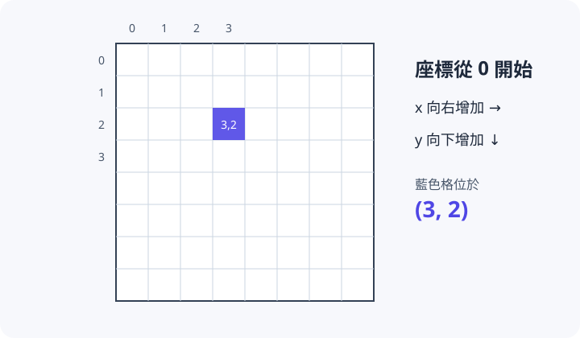

# 理解 Grid++ 核心模型

上一章的程式已經能開啟視窗並畫出網格，但空白網格還不能稱為遊戲。要讓角色出現在世界中並隨時間行動，程式必須進一步描述三件事：世界裡有哪些內容、這些內容如何改變，以及誰負責反覆執行整個過程。Grid++ 以 `GridObject` 表示世界中的物件，用普通函式描述物件每幀要做的事，再由 `GameEngine` 安排更新與繪製。

並非所有畫面內容都屬於遊戲世界。分數、倒數和按鈕雖然顯示在同一個視窗裡，卻不應占據地圖格子或參與碰撞，因此 Grid++ 另外使用 `Overlay` 表示它們。本章將從座標與物件的區別開始，逐步說明狀態如何在一幀中改變，以及 Engine 如何管理這些內容。掌握這套模型後，下一章的打地鼠程式就不再只是一組需要照抄的 API 呼叫。

## 世界使用網格座標

Grid++ 適合棋盤、迷宮與其他以格子為單位的遊戲，因為它把世界切成固定大小的網格，而不是要求遊戲規則直接處理每一個螢幕像素。物件位置使用 `(x, y)` 表示：原點 `(0, 0)` 在左上角，x 向右增加，y 向下增加。這套座標讓程式能以「向右一格」描述移動，而不必先知道畫面上的一格究竟有多少像素。

<figure markdown="span">
  
  <figcaption>座標從 0 開始；`(3, 2)` 表示第 4 欄、第 3 列。</figcaption>
</figure>

假設玩家位於 `(1, 1)`、豆子位於 `(2, 1)`，玩家向右移動一格後，兩者便會落在相同座標；Engine 可以據此判定碰撞，而不必比較兩張圖片的像素或計算矩形是否重疊。換句話說，網格座標首先服務的是遊戲規則，它讓「移動」與「相遇」都能用離散的位置表達。

螢幕最後仍以像素顯示畫面，所以 Engine 會在繪製時進行換算。若每格寬高為 64 像素，網格 `(2, 1)` 左上角的像素座標就是 `(128, 64)`。玩家、敵人和道具通常只需要關心自己位於哪一格；文字、按鈕和滑鼠位置需要精確安排在視窗中的位置，才直接使用像素座標。後面區分 GridObject 與 Overlay 時，這兩套座標也會成為重要判準。

## 先辨認世界裡的內容

確立座標系統後，下一步是判斷一項內容是否真的存在於遊戲世界。`GridObject` 表示占據世界位置的實體，例如玩家、敵人、豆子和地鼠；它保存目前座標、外觀與顯示狀態，也能在每幀更新或與其他物件同格時執行行為。只要某項內容會移動到另一格、被其他物件碰到，或影響地圖上的通行規則，它通常就應該是 GridObject。

`Overlay` 則表示不屬於地圖的畫面資訊，例如分數、倒數、提示訊息和按鈕。這些內容與 GridObject 顯示在同一個視窗，卻使用像素座標，也不參與網格碰撞；Engine 會等世界中的物件畫完後，再將 Overlay 畫在它們上方。因此判斷兩者時，可以先問：**這項內容是否存在於遊戲規則的某一格？**會占據格子並阻擋玩家的控制台是 GridObject；固定在視窗角落的分數則是 Overlay。

第 7 章的 Pac-Man 還會用到第三種內容 `Maze`，它一次保存整張地圖的牆面；在那之前，只要先分清 GridObject 與 Overlay 即可。

```text
GameEngine 管理整個遊戲
├── GridObject：存在於網格世界
│   ├── 玩家
│   ├── 敵人
│   └── 道具
└── Overlay：顯示於世界上方
    ├── 分數
    ├── 倒數
    └── 按鈕
```

## 狀態、行為與畫面

辨認內容屬於哪一類之後，還要區分它「目前是什麼」和「接下來要做什麼」。「狀態」是某個時間點保存的資料，例如地鼠座標、目前分數和遊戲是否結束；「行為」則是修改這些資料的規則，例如每秒更換座標或點中後加分。當狀態改變後，「繪製」才負責把最新結果呈現在畫面上。

Grid++ 刻意將這三件事分開：GridObject 與遊戲程式保存狀態，你寫的普通函式根據輸入修改狀態，Engine 再於每一幀呼叫這些函式並重畫畫面。例如，地鼠原本位於 `(3, 2)`，它的更新函式將座標改成 `(5, 6)`，繪製階段才把地鼠圖片放到新的格子。程式不必親自擦除舊圖片，因為畫面不是另一份需要同步維護的狀態，而是 Engine 根據當下資料重新產生的結果。

## 一幀如何運作

前面的狀態與行為不會自行運作，必須有人持續安排它們。呼叫 `run()` 後，Engine 便啟動遊戲主迴圈；視窗開啟期間，它預設以每秒 60 幀為目標，反覆執行以下流程：

```text
GridObject 更新
       ↓
檢查同格碰撞
       ↓
Overlay 更新（按鈕在這時處理點擊）
       ↓
依最新狀態繪製 GridObject
       ↓
繪製 Overlay
       ↓
進入下一幀
```

這個順序不是任意排列。物件先在更新階段移動，所以碰撞檢查使用的是移動後的新座標；碰撞函式若又將物件隱藏，接下來的繪製階段就不會再把它畫出來。下一章的地鼠也是每幀先執行更新函式，由函式判斷是否已到移動時間，最後讓畫面反映新的位置。

因此，使用 Grid++ 時，遊戲程式不必自己撰寫 `while` 迴圈，也不必從外部逐一呼叫每個物件。程式只需要描述「輪到這個物件更新時要做什麼」，Engine 便會把這項行為放進固定的每幀流程。這也說明了為什麼物件必須透過 Engine 建立：Engine 不知道的內容，自然不會進入更新、碰撞與繪製階段。

## Engine 擁有所有內容

Grid++ 的所有遊戲內容都由 Engine 建立：`game.addObject()` 建立 GridObject，`game.addTextOverlay()` 等函式建立 Overlay。Engine 保存這些內容本身，並在適當時間釋放它們；建立函式回傳給程式的，是一個用來操作該內容的 **Handler**。

```text
game.addObject() / game.addTextOverlay()
       ↓
Engine 建立並保存內容，回傳 Handler
       ↓
程式透過 Handler 讀寫內容
       ↓ remove() / clearObjects() / Engine 結束
內容被釋放，Handler 失效（exists() 變成 false）
```

可以把 Handler 想成一張「遙控器」：按下遙控器上的按鈕，會操作 Engine 保存的那個物件；把遙控器複製一份，得到的仍是控制同一個物件的遙控器，而不是多出一個新物件。程式不需要、也無法自行釋放內容，因此不會出現忘記釋放或重複釋放的錯誤。第 8 章會完整說明 Handler 的有效期限與執行期間新增、刪除的規則。

到這裡，核心模型的輪廓已經形成：GridObject 保存世界中的實體與狀態，Engine 安排它們逐幀運作，Overlay 則補上不屬於地圖的畫面資訊。接下來四節會沿著這個關係依序展開，前三節分別說明這些角色，第 4 節再補上製作遊戲時會直接使用的輸入、時間與亂數函式；素材、碰撞與生命週期細節則留到讀者已有實際經驗後，再於各自主題章深入處理。

## 完成本章後

- 能用網格座標描述世界中的位置，並分辨它與像素座標的用途。
- 能判斷一項內容應該是 GridObject 還是 Overlay。
- 能說明狀態、行為與繪製如何在 Engine 的每幀流程中接續發生。
- 能說明 Handler 與它所操作的內容之間的關係。
- 能依照遊戲需求讀取鍵盤、滑鼠、經過時間與隨機數。

[先認識 GridObject](01-grid-object.md){ .md-button .md-button--primary }
