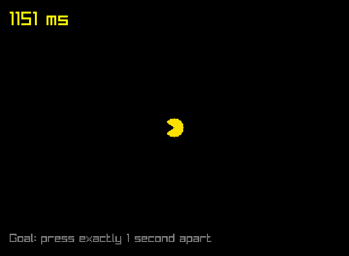

# 第 1 步：節奏大師

先來測測你的節奏感！每按一次空白鍵，小精靈就轉一下，畫面也會告訴你這次和上次按鍵**隔了幾毫秒**（1000 毫秒 = 1 秒）。目標是剛好隔 1 秒，誤差在 50 毫秒內，就會出現綠色的 **PERFECT!**



## 完整程式

```cpp title="main.cpp" linenums="1" hl_lines="2 8 10-11 13-30 37 40-41"
--8<-- "examples/pacman_tutorial/steps/step1.cpp"
```

--8<-- "docs_includes/run-command.md"

你能連續拿到幾次 PERFECT？

## 程式怎麼運作

### 每一幀都會執行的函式

遊戲畫面其實是一張張圖片快速播放出來的，每一張叫做一**幀**，Grid++ 每秒大約畫 60 幀。

```cpp
GridObject pacman = game.addObject("pacman", nullptr, Dance);
```

這行建立了小精靈，並且告訴 Grid++：「**每一幀都幫我執行一次 `Dance` 函式**」。所以 `Dance` 一秒會被執行 60 次，我們只要在裡面檢查「這一幀有沒有按空白鍵」就好。

### 讀取鍵盤

```cpp
if (!game.keyPressed(KEY_SPACE)) return;
```

`game.keyPressed(KEY_SPACE)` 只有在空白鍵**剛被按下的那一幀**是 `true`。這一幀沒按的話，`return` 直接結束函式，什麼都不做。

### 計算時間差

`game.time()` 會告訴你遊戲開始到現在過了幾秒。把「這次按下的時間」減掉「上次按下的時間」，就是兩次之間隔了多久：

```cpp
int gap = (now - last_press) * 1000;  // 換算成毫秒
```

`last_press` 寫在所有函式外面（全域變數），所以 `Dance` 結束後它的值還會留著，下一次按鍵時才找得到「上次」的時間。

### 改變畫面上的字

`message` 是畫在畫面最上層的文字，`setText` 換掉它的內容，`setColor` 換顏色。小精靈轉向用的是 `setDirection`，0、1、2、3 分別代表朝右、上、左、下。

## 試試看

- 把目標改成 0.5 秒（500 毫秒）。
- 把 `KEY_SPACE` 換成 `KEY_ENTER`，改用 Enter 鍵來玩。
- 挑戰：多一個 `perfect_count` 變數，記錄總共拿到幾次 PERFECT，顯示在畫面上。（提示：數字要變成文字，可以用 `std::to_string(perfect_count)`。）

--8<-- "docs_includes/stuck.md"

??? info "想知道更多？"

    - 「每一幀」的完整流程，請看[理解核心模型](../03-core-model/index.md)。
    - 更多鍵盤、滑鼠和時間的用法，請看[輸入、時間與亂數](../03-core-model/04-input-and-time.md)。

[第 2 步：小精靈出發](02-move.md){ .md-button .md-button--primary }
