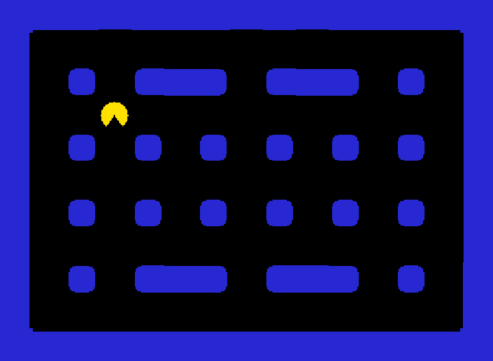

# 第 3 步：迷宮

沒有牆的 Pac-Man 太好走了。這一步要蓋一座迷宮，而且我們的地圖是用**文字畫出來的**。



## 完整程式

```cpp title="main.cpp" linenums="1" hl_lines="6 8-30 34-35 38-39 42-43 46-47 52 56-62 65"
--8<-- "examples/pacman_tutorial/steps/step3.cpp"
```

--8<-- "docs_includes/run-command.md"

## 程式怎麼運作

### 用文字畫地圖

```cpp
const char* kMap[kRows] = {
    "###############",
    "#P............#",
    ...
};
```

這是一個字串陣列，每個字串是地圖的一列，每個字元是一格：`#` 是牆，其他都是通道。`kMap[y][x]` 就是第 `y` 列、第 `x` 欄的那一格。`.`、`P`、`G` 現在還用不到，之後的步驟會派上用場。

### 把牆蓋起來

```cpp
for (int y = 0; y < kRows; ++y) {
    for (int x = 0; x < kCols; ++x) {
        if (kMap[y][x] == '#') maze.setWall(x, y);
    }
}
```

兩層迴圈走過地圖的每一格，看到 `#` 就呼叫 `maze.setWall(x, y)` 在那裡蓋牆。`setWallImages` 會依照每面牆和隔壁牆的相連方式，自動選出直線、轉角或交叉的圖片，所以牆壁會連成漂亮的形狀。

### 撞牆就停下來

```cpp
void Walk(GridObject who, int dx, int dy) {
    if (maze.isWall(who.x() + dx, who.y() + dy)) return;
    who.move(dx, dy);
}
```

走之前先算出**下一格**的座標，用 `maze.isWall` 問問看那裡是不是牆。是牆就 `return`，不移動。我們把這段寫成 `Walk` 函式，因為下一步的鬼也會用到它。

## 試試看

- 改改看 `kMap`，畫一座你自己的迷宮。（注意：每一列都要剛好 15 個字元，最外圈最好都是牆。）
- 把 `48` 改成 `32` 或 `64`，整個畫面會怎麼變？
- 挑戰：在地圖中間挖一條「祕密通道」，讓小精靈從左邊牆壁的洞穿出去，從右邊出來。（提示：先把左右兩邊同一列的 `#` 改成 `.`，再在 `Walk` 裡判斷 x 超出範圍的情況。）

--8<-- "docs_includes/stuck.md"

??? info "想知道更多？"

    `Maze` 的更多用法，例如從檔案讀取地圖，請看[地圖與迷宮](../08-pacman/01-map-and-maze.md)。

[第 4 步：鬼來了](04-ghost.md){ .md-button .md-button--primary }
