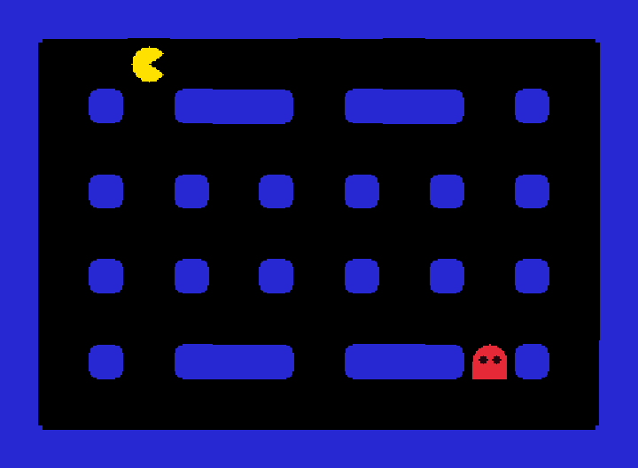
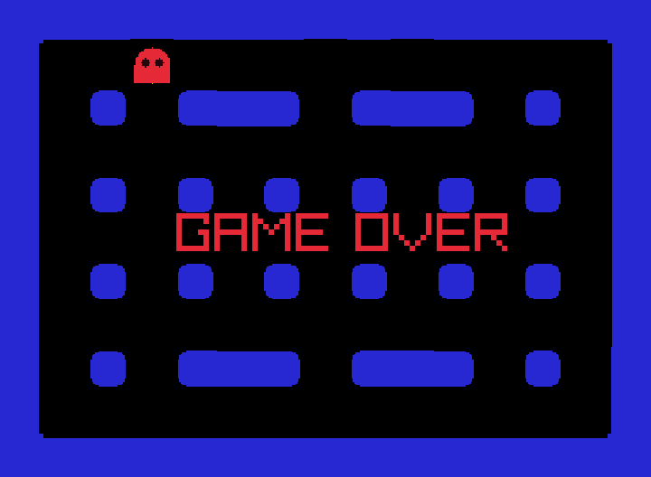

# 第 4 步：鬼來了

找個朋友一起玩！這一步加入一隻紅色的鬼，由第二位玩家用 **W、A、S、D** 控制。鬼抓到小精靈，遊戲就結束。



| 玩家 | 角色 | 按鍵 |
|---|---|---|
| 玩家 1 | 小精靈 | 方向鍵 |
| 玩家 2 | 鬼 | W 上、A 左、S 下、D 右 |

## 完整程式

```cpp title="main.cpp" linenums="1" hl_lines="7 26-27 35-44 47 67-75 90 93-95 97-98"
--8<-- "examples/pacman_tutorial/steps/step4.cpp"
```

--8<-- "docs_includes/run-command.md"

被抓到時會像這樣：



## 程式怎麼運作

### 碰撞：撞在同一格時通知你

```cpp
GridObject pacman = game.addObject("pacman", nullptr, MovePacman, PacmanHit);
```

`addObject` 的第 4 個參數是**碰撞函式**。每一幀所有東西都移動完之後，Grid++ 會檢查有沒有兩個物件站在同一格；有的話，就呼叫它們的碰撞函式。

```cpp
void PacmanHit(GameEngine, GridObject, GridObject other) {
    if (other.image() == "ghost") GameOver();
}
```

`other` 是撞到小精靈的那個物件。我們用 `other.image()` 看它的圖片名稱，是 `"ghost"` 才算被抓到。第 6 步會出現豆子，到時候小精靈也會撞到豆子，所以先確認撞到的是誰很重要。

### 遊戲結束

```cpp
bool game_over = false;
```

`game_over` 記錄遊戲是否已經結束。`GameOver()` 會把它設成 `true`，並顯示原本藏起來（`hide()`）的 GAME OVER 文字。兩個移動函式一開頭都會檢查它：遊戲結束了，就誰都不能再動。

### 同一個 Walk，兩個角色

鬼的移動和小精靈幾乎一樣，只是換了按鍵。因為上一步把「撞牆就停」寫成了 `Walk` 函式，鬼可以直接拿來用。這就是把程式寫成函式的好處。

## 試試看

- 讓鬼走得比小精靈慢：鬼每按兩次才走一格。（提示：用一個變數數按了幾次。）
- 被抓到後，按 R 重新開始。（提示：把兩隻角色放回起點，把 `game_over` 設回 `false`，再用 `message.hide()` 藏起文字。）
- 再加一隻鬼，用 I、J、K、L 控制，變成三人對戰！

--8<-- "docs_includes/stuck.md"

??? info "想知道更多？"

    碰撞的完整規則，例如哪些物件不會被檢查，請看[同格互動](../05-object-behavior/02-collisions.md)。

[第 5 步：鬼會自己追](05-chase.md){ .md-button .md-button--primary }
