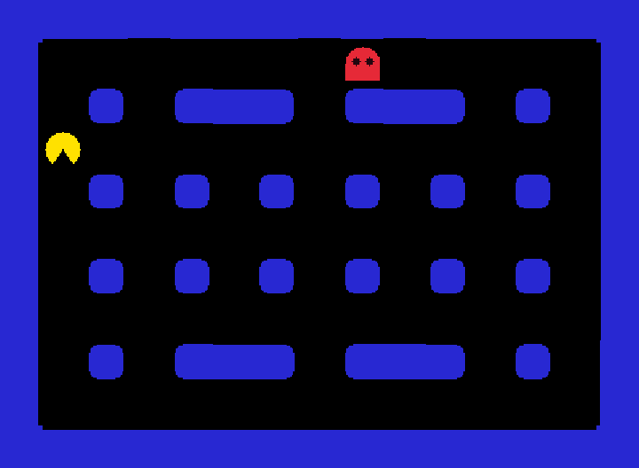

# 第 5 步：鬼會自己追

朋友回家了？沒關係，這一步讓鬼**自己動腦**追小精靈。你會寫出遊戲裡的第一個「AI」！



## 完整程式

```cpp title="main.cpp" linenums="1" hl_lines="2 28 70-109 124 127"
--8<-- "examples/pacman_tutorial/steps/step5.cpp"
```

--8<-- "docs_includes/run-command.md"

撐得過 30 秒嗎？

## 程式怎麼運作

### 鬼多久走一步

```cpp
if (game.time() < ghost_next_move) return;  // 還沒輪到鬼走
ghost_next_move = game.time() + 0.3;
```

還記得第 1 步的 `game.time()` 嗎？`ghost_next_move` 記住「鬼下一次可以走的時間」。時間還沒到就 `return`；時間到了，就把下一次訂在 0.3 秒後，然後走一步。所以鬼每 0.3 秒走一格。

### 鬼的大腦

鬼每次要走的時候，會這樣想：

1. 看看上、下、左、右四個方向。
2. 跳過牆壁，也不要往回走。
3. 算算看走過去之後離小精靈多遠，選**最近**的那個方向。

```cpp
int distance = std::abs(x - pacman.x()) + std::abs(y - pacman.y());
```

「多遠」是用橫向距離加上縱向距離來算的（`std::abs` 是絕對值）。`kDX`、`kDY` 兩個陣列記下每個方向要怎麼移動，例如方向 0（右）就是 `kDX[0] = 1`、`kDY[0] = 0`。

為什麼不能往回走？試試看把 `if (d == back) continue;` 刪掉，鬼會常常卡在牆角左右抖動。只有走進死路的時候，鬼才會回頭。

### 咦？鬼穿過去了？

你可能注意到，`ChasePacman` 在移動**前**和移動**後**都用 `Caught` 檢查了一次。明明第 4 步的碰撞函式就會抓到同一格的情況，為什麼還要自己檢查？

因為有一種情況，碰撞函式抓不到：**小精靈和鬼面對面，在同一幀一起往對方走一格。**

```text
走之前：  . P G .      P 在第 1 格，G 在第 2 格
走之後：  . G P .      兩個交換了位置！
```

Grid++ 是在所有東西**都走完之後**才檢查碰撞。這時候兩者剛好交換位置，從來沒有站在同一格過，於是鬼就「穿過」小精靈了。

所以鬼要自己多看兩眼：

- **走之前**：如果小精靈已經自己撞進鬼的格子，就是抓到了。
- **走之後**：如果鬼撲進了小精靈的格子，也是抓到了。這時遊戲已經結束，小精靈就沒機會再逃走。

這樣不管小精靈和鬼誰先移動，都不會再穿過去。

!!! example "親眼看看這個問題"

    把兩段 `if (Caught(self)) ...` 都刪掉，然後在走廊上正面迎向鬼，多試幾次。偶爾會看到鬼直接穿過小精靈！看完記得改回來。

## 試試看

- 把 `0.3` 改成 `0.15`，鬼會變得多可怕？
- 讓鬼越來越快：每走一步，就把等待時間縮短一點點。
- 挑戰：再加一隻鬼，讓它**隨機**選方向，而不是追著小精靈。（提示：`game.random(0, 3)` 會隨機給你 0 到 3 的整數。第二隻鬼需要自己的 `ghost_direction` 和 `ghost_next_move`。）

--8<-- "docs_includes/stuck.md"

??? info "想知道更多？"

    完整版 Pac-Man 有四隻各有個性的鬼，每隻鬼都用 `set()` 和 `get()` 記住自己的方向和計時器。請看[多隻鬼的獨立狀態](../08-pacman/04-ghosts.md)。

[第 6 步：吃豆子](06-pellets.md){ .md-button .md-button--primary }
