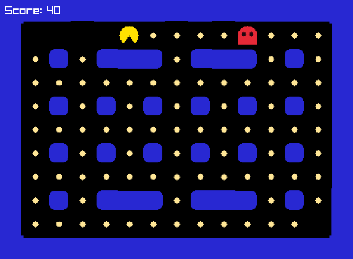

# 從零做出 Pac-Man

這一章結束時，你會親手做出這個遊戲：小精靈在迷宮裡吃豆子，紅色的鬼會一路追著你跑。

我們不會一次寫完，而是分成六步，每一步只加一點點新東西，而且**每一步做完都能玩**。

| 步驟 | 做出什麼 | 學到什麼 |
|---|---|---|
| [1. 節奏大師](01-rhythm.md) | 按空白鍵，測你的節奏感 | 讀取鍵盤、計算時間 |
| [2. 小精靈出發](02-move.md) | 用方向鍵控制小精靈 | 移動物件 |
| [3. 迷宮](03-maze.md) | 撞到牆就走不過去 | 用陣列畫地圖、判斷牆壁 |
| [4. 鬼來了](04-ghost.md) | 兩人對戰：一人當鬼，被抓到就輸 | 碰撞 |
| [5. 鬼會自己追](05-chase.md) | 鬼自動追著小精靈跑 | 讓電腦自己做決定 |
| [6. 吃豆子](06-pellets.md) | 吃光豆子就贏了 | 分數與勝利條件 |

## 每一步怎麼做

1. 把頁面上的**完整程式**複製下來，貼到 `main.cpp`，**取代原本全部的內容**。
2. 存檔，編譯並執行，玩玩看。
3. 讀「程式怎麼運作」，了解新加的程式碼在做什麼。程式碼中有底色標示的行，就是這一步新加或修改的地方。
4. 挑戰「試試看」，自己改改看程式。
5. [上傳到 Gitea](../01-getting-started/05-save.md)。

!!! tip "改壞了也不用怕"

    「試試看」把程式改壞了也沒關係，下一步會再貼上一份完整的新程式。專案的 `steps/` 資料夾裡也有每一步的參考答案。

[第 1 步：節奏大師](01-rhythm.md){ .md-button .md-button--primary }
