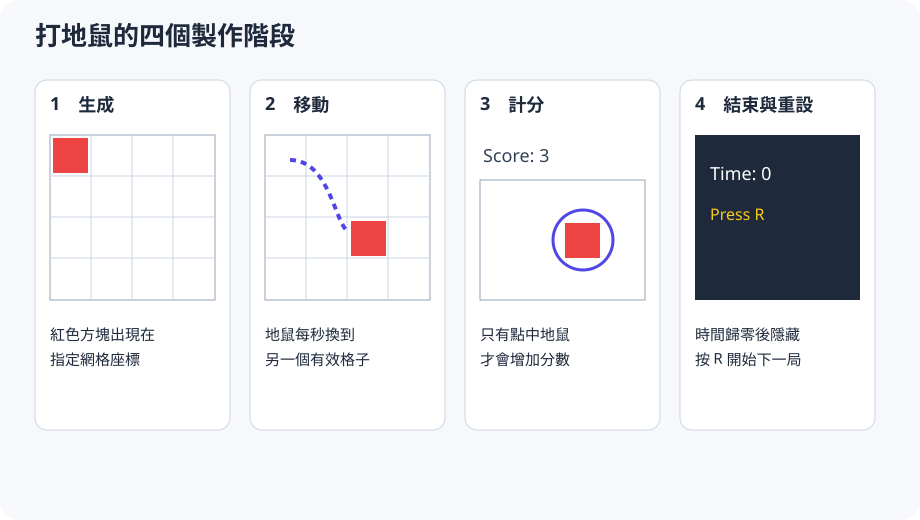

# 製作打地鼠

第一章建立了可以運作的空白世界，第二章則說明物件、行為、Engine 與 Overlay 如何合作。現在要把兩部分合在一起，做出一個真正具有目標和結束條件的遊戲：8×8 網格中有一隻每秒換位的地鼠，玩家在 30 秒內點中它便得到一分；倒數結束後，按 R 可以重設狀態並開始下一局。

接下來會依序加入地鼠、定時移動、點擊計分、倒數與重設；四個里程碑各自附有當下完整的 `main.cpp`，可以直接編譯並觀察新增的遊戲行為。

<figure markdown="span">
  
  <figcaption>打地鼠會從靜態物件逐步增加移動、計分與一局遊戲的完整流程。</figcaption>
</figure>

## 里程碑一：生成靜態地鼠

空白網格已經能持續運作，現在缺少的是存在於世界中的遊戲目標。第一個里程碑暫時不處理移動和計分，只生成一隻靜止的地鼠，用來確認 GridObject 已加入 Engine，且指定的網格座標會正確反映在畫面上。把 `main.cpp` 改成：

```cpp title="main.cpp"
#include "GridPlusPlus.h"

using gridpp::GridEngine;

int main() {
    GridEngine game(8, 8, 64);
    game.set_show_grid(true);
    game.Spawn("mole", 0, 0, nullptr);
    game.Run();
    return 0;
}
```

`Spawn()` 的四個參數依序是素材名稱、x 座標、y 座標與 `UpdateFn`。最後的 `nullptr` 表示這個物件暫時沒有更新函式，因此每幀只會維持原本狀態。由於尚未載入名為 `mole` 的素材，Engine 會用紅色方塊代替；這讓遊戲規則不必等待美術素材。

執行後，紅色方塊應位於左上角 `(0, 0)`。把座標改成 `(3, 2)` 再執行一次：它應出現在第 4 欄、第 3 列。若能在執行前預測位置，就已理解零起算的網格座標。

## 里程碑二：讓地鼠每秒移動

靜止的方塊已經證明物件能進入世界，但打地鼠的目標必須定期換位，玩家才需要追蹤它。第二章提到 Engine 每幀都會執行物件的 `UpdateFn`；如果函式每次執行都更換座標，地鼠一秒可能移動約 60 次，快到無法遊玩。因此這一步除了加入更新函式，還要保存「下一次允許移動的時間」，讓尚未到達指定時間的幀直接返回。

```cpp title="main.cpp"
#include "GridPlusPlus.h"

using gridpp::GridEngine;
using gridpp::GridObject;

double next_move = 0.0;

void UpdateMole(GridObject* mole) {
    if (GetTime() < next_move) return;

    mole->set_x(GetRandomValue(0, mole->engine()->cols() - 1));
    mole->set_y(GetRandomValue(0, mole->engine()->rows() - 1));
    next_move = GetTime() + 1.0;
}

int main() {
    GridEngine game(8, 8, 64);
    game.set_show_grid(true);
    game.Spawn("mole", 0, 0, UpdateMole);
    game.Run();
    return 0;
}
```

`GetTime()` 是 raylib 函式，回傳視窗建立後經過的秒數。第一次更新時 `next_move` 是 0，因此地鼠立即選擇新位置，再把下次移動排在一秒後。後續大部分幀都會在第一個 `if` 返回。

`GetRandomValue(min, max)` 會回傳包含上下界的整數。有效 x 座標是 0 到 `cols - 1`，有效 y 座標則是 0 到 `rows - 1`，所以地鼠不會跑出網格。

此處的 `next_move` 在概念上屬於地鼠，卻暫時放在全域，讓普通函式能保存下一幀仍要使用的資料。這種寫法只適合目前的一隻地鼠：若生成第二隻，兩者會共用同一個移動時間。第 5 章會把個別狀態放回各自的物件實例。

這個版本執行後，紅色方塊應每秒移動一次，而且永遠留在網格範圍內。為了確認真正控制速度的是下一次移動時間，而不是 Engine 的幀率，可以把 `1.0` 暫時改成 `0.2`：在重新執行前，先預測地鼠會變成每 0.2 秒移動，再以畫面驗證推論，最後將數值改回來。

參考程式：[step_02_mole.cpp](https://github.com/GridPlusPlus/GridPlusPlus/blob/main/examples/whack_a_mole/step_02_mole.cpp)

## 里程碑三：判斷點擊並顯示分數

能夠移動的地鼠仍然只是動畫，因為玩家目前無法和它互動。要判斷玩家是否點中地鼠，程式必須比較滑鼠與地鼠的位置；問題在於滑鼠使用像素座標，地鼠使用網格座標，兩者不能直接相比。由於每格寬高都是 `grid_size` 像素，將滑鼠的 x、y 分別除以格子大小，就能換算出滑鼠所在的格子：

```text
mouse pixel (220, 150) ÷ grid size 64 → grid cell (3, 2)
```

這一步新增兩種全域狀態：`score` 是遊戲規則的資料；`score_label` 是指向畫面物件的借用指標。Label 的所有權屬於 Engine，程式只透過指標更新文字，不能自行 `delete`。

```cpp title="main.cpp"
#include "GridPlusPlus.h"

#include <string>

using gridpp::GridEngine;
using gridpp::GridObject;
using gridpp::Label;

int score = 0;
double next_move = 0.0;
Label* score_label = nullptr;

void UpdateMole(GridObject* mole) {
    const Vector2 mouse = GetMousePosition();
    const int grid_size = mole->engine()->grid_size();
    const int mouse_x = static_cast<int>(mouse.x) / grid_size;
    const int mouse_y = static_cast<int>(mouse.y) / grid_size;

    if (IsMouseButtonPressed(MOUSE_BUTTON_LEFT) && mouse_x == mole->x() && mouse_y == mole->y()) {
        ++score;
        score_label->set_text("Score: " + std::to_string(score));
        next_move = 0.0;
    }

    if (GetTime() >= next_move) {
        mole->set_x(GetRandomValue(0, mole->engine()->cols() - 1));
        mole->set_y(GetRandomValue(0, mole->engine()->rows() - 1));
        next_move = GetTime() + 1.0;
    }
}

int main() {
    GridEngine game(8, 8, 64);
    game.set_show_grid(true);

    score_label = new Label("Score: 0", 12, 12, 24, BLACK);
    game.AddOverlay(score_label);

    game.Spawn("mole", 0, 0, UpdateMole);
    game.Run();
    return 0;
}
```

每幀先把滑鼠像素換成網格座標，再檢查左鍵是否剛被按下且兩組座標是否相同。打中後分數增加，Label 顯示新值，`next_move = 0.0` 讓地鼠在同一次 update 後半立刻換位，避免停在原格被連續點擊。

執行後，點中地鼠應使左上角分數增加，而且地鼠立即換位；點擊其他格不應加分。把 `mouse_x == mole->x()` 暫時改成 `mouse_x != mole->x()`，先預測錯誤行為，再執行確認並還原。這個反例能驗證得分來自座標比較，而不是 Label 或素材。

## 里程碑四：加入倒數、結束與重設

最後一個里程碑分成兩個小步驟：先讓這一局能夠倒數並停止，再讓玩家重設同一組物件。兩個步驟共同使用 `end_time` 和第二個 Label；`end_time` 保存這一局結束的絕對時間，每幀用「結束時間減去目前時間」得到剩餘秒數。計算時，`std::max()` 避免畫面顯示負數，`std::ceil()` 則讓尚未完整經過的一秒仍顯示出來。

### 先讓一局遊戲正確結束

先只處理倒數與停止：在 `UpdateMole()` 開頭更新時間文字，時間歸零後隱藏地鼠並直接返回。此時不必急著加入重設功能，先確認倒數到 0 之後，地鼠確實不再移動或得分。

```cpp title="UpdateMole() 開頭：倒數結束後停止遊戲"
const double remaining = std::max(0.0, end_time - GetTime());
const int seconds = static_cast<int>(std::ceil(remaining));
time_label->set_text("Time: " + std::to_string(seconds));

if (remaining <= 0.0) {
    mole->set_visible(false);
    return;
}
```

這段程式成立後，一局遊戲已經有明確的開始與結束；接下來的重設不是另一套遊戲流程，而是把分數、時間、地鼠位置與畫面重新帶回可玩的初始狀態。

### 再加入重設功能

遊戲結束時，`set_visible(false)` 讓地鼠不再繪製。隱藏物件仍會執行 `UpdateFn`，所以 `UpdateMole` 可以繼續等待 R 鍵；按下後，`ResetGame()` 重設整局狀態並重新顯示原物件，不需要建立第二個 Engine 或第二隻地鼠。

```cpp title="main.cpp"
#include "GridPlusPlus.h"

#include <algorithm>
#include <cmath>
#include <string>

using gridpp::GridEngine;
using gridpp::GridObject;
using gridpp::Label;

// 整局遊戲的狀態。
int score = 0;
double end_time = 0.0;

// 單一地鼠的狀態；第 5 章會把它移入自訂物件。
double next_move = 0.0;

// Engine 擁有 Label，這兩個變數只是借用指標。
Label* score_label = nullptr;
Label* time_label = nullptr;

void ResetGame(GridObject* mole) {
    score = 0;
    end_time = GetTime() + 30.0;
    next_move = 0.0;
    mole->set_visible(true);
    score_label->set_text("Score: 0");
    time_label->set_text("Time: 30");
}

void UpdateMole(GridObject* mole) {
    const double remaining = std::max(0.0, end_time - GetTime());
    const int seconds = static_cast<int>(std::ceil(remaining));
    time_label->set_text("Time: " + std::to_string(seconds));

    if (remaining <= 0.0) {
        mole->set_visible(false);
        if (IsKeyPressed(KEY_R)) ResetGame(mole);
        return;
    }

    const Vector2 mouse = GetMousePosition();
    const int grid_size = mole->engine()->grid_size();
    const int mouse_x = static_cast<int>(mouse.x) / grid_size;
    const int mouse_y = static_cast<int>(mouse.y) / grid_size;

    if (IsMouseButtonPressed(MOUSE_BUTTON_LEFT) && mouse_x == mole->x() && mouse_y == mole->y()) {
        ++score;
        score_label->set_text("Score: " + std::to_string(score));
        next_move = 0.0;
    }

    if (GetTime() >= next_move) {
        mole->set_x(GetRandomValue(0, mole->engine()->cols() - 1));
        mole->set_y(GetRandomValue(0, mole->engine()->rows() - 1));
        next_move = GetTime() + 1.0;
    }
}

int main() {
    GridEngine game(8, 8, 64);
    game.set_show_grid(true);

    score_label = new Label("Score: 0", 12, 12, 24, BLACK);
    time_label = new Label("Time: 30", 12, 44, 24, BLACK);
    game.AddOverlay(score_label);
    game.AddOverlay(time_label);

    GridObject* mole = game.Spawn("mole", 0, 0, UpdateMole);
    ResetGame(mole);
    game.Run();
    return 0;
}
```

參考程式：[完整打地鼠](https://github.com/GridPlusPlus/GridPlusPlus/blob/main/examples/whack_a_mole/main.cpp)

## 編譯與驗收

四個里程碑都是彼此獨立的完整程式，因此每完成一步，都應使用第一章中對應平台的方式重新編譯。WSL 與 Linux 可執行以下指令；macOS 和 Windows 則沿用第一章列出的連結參數：

```bash
g++ -std=c++17 main.cpp -o game \
    -lraylib -lGL -lm -lpthread -ldl -lrt -lX11
./game
```

編譯成功只代表程式符合語法與連結要求，還不能證明遊戲規則正確。執行完成版後，應依序操作並確認以下行為；任何一項不符合，都表示對應里程碑仍有尚未解決的問題：

- 開始時顯示 `Score: 0` 與 `Time: 30`。
- 地鼠每秒換位，且位置不超出 8×8 網格。
- 只有點中地鼠所在格才加分；加分後地鼠立即換位。
- 倒數不顯示負數；到 0 時地鼠消失且點擊不再得分。
- 按 R 後分數與時間重設，原本的地鼠重新出現。

## 回頭解釋這份程式

完成遊戲後，再回頭看整份程式，各段程式的責任應比一開始更清楚。這個小型範例刻意使用普通函式與全域狀態，讓 `UpdateFn` 如何取得目前物件、像素如何換成網格座標，以及 Engine 如何持有內容都直接顯露出來。這不是大型遊戲的最終架構，而是用最少機制建立後續章節所需的共同經驗：

- `GridEngine` 建立世界並逐幀呼叫行為。
- 地鼠是 `GridObject`；`UpdateMole` 是交給它的 `UpdateFn`。
- `score` 與 `end_time` 屬於整局遊戲，`next_move` 概念上屬於單一地鼠。
- Label 是 Overlay，只呈現狀態；Engine 擁有 Label，程式保留借用指標。
- `set_visible(false)` 改變繪製與碰撞，但保留更新行為，因此可等待重設。

目前只有一隻地鼠，因此上述簡化還不會造成衝突；當遊戲開始出現不同碰撞規則或多個各自計時的物件時，全域狀態便會逐漸失去表達能力。第 4 章將完整說明 `UpdateFn` 與 `CollideFn`，第 5 章再引入繼承及生命週期方法，並比較這兩種描述行為的方式。如此一來，架構的改變由實際問題推動，而不是只為了使用更複雜的語法。

[定義物件行為](../04-object-behavior/index.md){ .md-button .md-button--primary }
