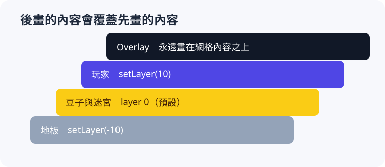

# 用同一個物件狀態控制畫面

載入素材或建立基本圖形之後，畫面仍會隨遊戲狀態改變：玩家轉彎時圖片需要旋轉，受傷的敵人可能變色，遊戲結束後地鼠要暫時消失，而同格物件還必須決定誰畫在上方。GridObject 因此把素材名稱、方向、顏色、可見狀態與 layer 保存為外觀狀態；Engine 每一幀依照這些值繪製物件，遊戲規則只需要修改狀態，不必直接操作底層圖形。

## 方向與顏色

先處理同一個角色在格子內如何改變外觀。`setDirection()` 使用 90 度為單位旋轉圖片，0 保持原始方向，1、2、3 分別逆時針旋轉 90、180、270 度，而其他整數會正規化到 0～3。下一章的 Pac-Man 會讓右、上、左、下使用相同編號，因此只需一張朝右的圖片便能顯示四個方向。

```cpp title="方向值示意"
player.setDirection(0);  // 右
player.setDirection(1);  // 上
player.setDirection(2);  // 左
player.setDirection(3);  // 下
```

方向解決旋轉，`setColor()` 則處理同一張圖片的顏色變化。它接受 raylib 的 `Color`：`WHITE` 保留原色，其他顏色會與圖片混合，這種效果稱為色調（tint）。因此 Pac-Man 的四隻鬼可以共用白色 ghost 素材，再分別以 `RED`、`PINK`、`SKYBLUE` 和 `ORANGE` 顯示；素材名稱決定基礎圖片，方向與顏色則在繪製時補上物件自己的呈現狀態。對基本圖形而言，`setColor()` 直接決定填滿的顏色。

## 顯示與隱藏

旋轉與染色改變「怎麼畫」，可見狀態則決定「現在要不要畫」。`hide()` 會使物件停止繪製與碰撞，卻仍把物件保留在 Engine 中繼續更新，因此打地鼠可以在 30 秒結束時隱藏地鼠，等玩家按下 R 後重設座標並用 `show()` 重新顯示同一個物件，而不必為一次暫停移除並重建資料。

```cpp title="遊戲流程節錄：隱藏與重新顯示"
mole.hide();

// 重新開始。
mole.setPosition(0, 0);
mole.show();
```

`visible()` 可以讀取目前是否可見。永久移除的物件則應呼叫 `remove()`；`hide()` 只是物件狀態，不會釋放資源，也不會停止 Update。

## layer

當多個可見物件落在同一格時，Engine 先繪製 layer 較小的物件，再繪製較大的，因此數值較大的物件會覆蓋在上方；預設值是 0，負數可用於地板或背景，而玩家則可使用較大的值，讓角色不會被同格豆子遮住。

```cpp title="繪製層級示意"
floor.setLayer(-10);
pellet.setLayer(0);
player.setLayer(10);
```

<figure markdown="span">
  
  <figcaption>GridObject 依 layer 由小到大繪製；Overlay 最後繪製。</figcaption>
</figure>

相同 layer 會保留建立順序，後建立的物件畫在先建立的物件上方。迷宮（第 7 章）也和一般物件一起依建立順序繪製，而它的 layer 固定為 0；想讓某個物件畫在迷宮下方，只要給它負的 layer 即可。每幀更新期間呼叫 `setLayer()`，新值會影響同一幀稍後的繪製；layer 不改變更新與碰撞順序，也不適用於 Overlay，因為 Overlay 永遠位於所有網格內容上方，彼此之間則依建立順序繪製。

## 狀態與畫面的責任

上述外觀狀態都是「描述」，而不是「動作」：程式在 Update 或 Collide 中修改方向、顏色、可見狀態與 layer，Engine 在同一幀的繪製階段讀取最新的值，把它們轉換成畫面。遊戲規則因此不需要知道圖片何時被畫出、要怎麼擦掉舊的畫面；只要物件的狀態正確，畫面就會正確。

需要更複雜的畫面時，可以組合多個物件，例如在角色上方放一個 layer 較大的小圓形表示生命值，並在 Update 中讓它跟著角色移動。每個組成部分仍遵守相同的座標、layer 與可見狀態規則。

## 本節小結

- `setDirection()` 以 90 度為單位旋轉圖片，`setColor()` 改變圖片色調或圖形顏色。
- `hide()` 停止繪製和碰撞，但物件仍持續更新；`show()` 讓它重新出現。
- layer 越大越晚繪製；相同值依建立順序，迷宮的 layer 固定為 0。
- Overlay 永遠畫在所有網格內容之上。

[解析完整的 Pac-Man 範例](../07-pacman/index.md){ .md-button .md-button--primary }
