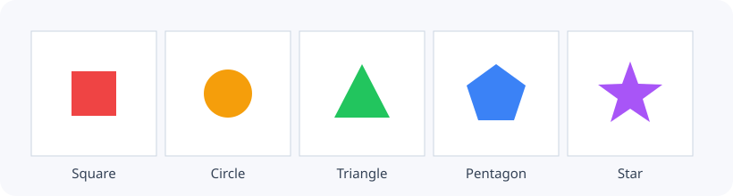

# 不需素材的基本圖形

素材適合呈現角色和場景的完整圖片，但不是每個遊戲都需要先準備美術。原型、作業與規則測試通常只需要能辨識不同物件的形狀和顏色。Grid++ 因此內建五種填滿的基本圖形；它們和圖片物件一樣是 GridObject，具有網格座標、顏色、layer、顯示狀態、Update、Collide 與 `set()`／`get()` 資料，差別只在繪製方式：基本圖形直接畫出幾何形狀，不會向素材包查詢圖片。

```cpp title="main.cpp：建立一個圓形"
#include "GridPlusPlus.h"

int main() {
    gridpp::GameEngine game(8, 8, 64);
    game.addCircle(2, 3, 36, BLUE);
    game.run();
    return 0;
}
```

圖形建立函式的參數依序是網格 x、網格 y、像素尺寸與顏色。和 `addObject()` 不同，圖形在建立時就直接指定位置，因此不需要另外呼叫 `setPosition()`。尺寸代表圖形外接框的寬度，圖形會置中於所在格；尺寸可以大於格子，引擎不會裁切或自動縮小，超出視窗的部分則不會顯示。

## 可用圖形

五種圖形使用相同的參數形式；顏色省略時為黑色，後方還可以依序附加 Init、Update 與 Collide 函式：

```cpp title="函式簽名示意"
addSquare(x, y, size, color, init, update, collide);
addCircle(x, y, size, color, init, update, collide);
addTriangle(x, y, size, color, init, update, collide);
addPentagon(x, y, size, color, init, update, collide);
addStar(x, y, size, color, init, update, collide);
```

下列程式將五種圖形放在同一列：

```cpp title="main() 節錄：建立五種基本圖形"
game.addSquare(0, 1, 32, RED);
game.addCircle(1, 1, 32, ORANGE);
game.addTriangle(2, 1, 32, GREEN);
game.addPentagon(3, 1, 32, BLUE);
game.addStar(4, 1, 32, PURPLE);
```

<figure markdown="span">
  
  <figcaption>五種圖形共用相同參數形式，`size` 控制圖形在格子中的像素大小。</figcaption>
</figure>

## 尺寸、顏色與行為

尺寸在建立時決定，而且必須大於 0，否則建立函式會丟出 `std::invalid_argument`。顏色則沿用 GridObject 共通的 `color()` 與 `setColor()`，沒有另一套圖形專用狀態；方向（`setDirection()`）只影響圖片物件，不會旋轉基本圖形。

圖形也能像圖片物件一樣擁有行為。以下的目標每秒向右移動一格，被玩家碰到時變成粉紅色：

```cpp title="main.cpp 節錄：會移動與碰撞的圖形"
void MoveTarget(GameEngine game, GridObject self) {
    double next_move = 0.0;
    self.get("nextMove", next_move);
    if (game.time() < next_move) return;

    if (self.x() < game.cols() - 1) self.move(1, 0);
    self.set("nextMove", game.time() + 1.0);
}

void HitTarget(GameEngine, GridObject self, GridObject other) {
    std::string type;
    other.get("type", type);
    if (type == "pacman") self.setColor(PINK);
}

// 放在 main() 內：
GridObject target = game.addCircle(0, 3, 24, RED, nullptr, MoveTarget, HitTarget);
target.set("nextMove", 0.0);
```

圖形沒有素材名稱，因此對它呼叫 `image()` 或 `setImage()` 會丟出錯誤；其餘 GridObject 操作與圖片物件完全相同，`clearObjects()` 也會一起清除圖形。

## 本節小結

- 五種基本圖形不需素材包，也能參與一般物件的更新與碰撞流程。
- 圖形建立時直接指定網格座標；尺寸使用像素，建立後不能改變。
- 顏色沿用 `setColor()`；方向不會旋轉圖形。

執行五種圖形的範例後，視窗中應在 y=1 的一列由左至右看到紅色方形、橘色圓形、綠色三角形、藍色五邊形與紫色五角星，而且每個圖形都置中於自己的格子。如果圖形偏離格子中心，應先檢查傳入的是網格座標而不是像素座標；如果圖形互相重疊，則應比較 `size` 與 Engine 的格子大小。

[外觀與繪製順序](03-rendering.md){ .md-button .md-button--primary }

完整函式列表見 [GameEngine API](../api/classgridpp_1_1GameEngine.md)。
